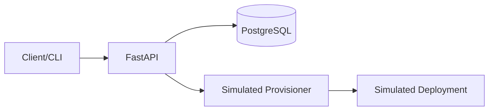

# Internal Developer Platform–Style API 🚀

[](https://sonarcloud.io/summary/new_code?id=null-pointer-sch_internal-platform-api)

A **full-stack platform demo** built with **FastAPI** (Backend) and **Angular** (Frontend) that explores patterns commonly used in **internal developer platforms** and platform engineering teams.

The API manages **projects**, **environments**, and **deployments**, inspired by tools such as Heroku, Render, Backstage, Humanitec, and custom internal PaaS solutions.



This project intentionally uses **simulated provisioning and deployment flows** to focus on **API design, data modelling, authentication, and platform concepts**, rather than real infrastructure execution.

---

## 🌍 Live Demo (Cloud Run – Europe)

- **Frontend UI**: https://internal-platform-api-frontend-3vr6excz6q-ew.a.run.app
- **Backend API**: https://internal-platform-api-backend-3vr6excz6q-ew.a.run.app
- **API Docs**: [Swagger UI](https://internal-platform-api-backend-3vr6excz6q-ew.a.run.app/docs) | [ReDoc](https://internal-platform-api-backend-3vr6excz6q-ew.a.run.app/redoc)
- **Health Check**: https://internal-platform-api-backend-3vr6excz6q-ew.a.run.app/health

---

### Production Deployment
- **Backend**: Google Cloud Run (fully managed, auto-scaling, serverless)
- **Database**: Neon (serverless PostgreSQL with connection pooling)
- **Authentication**: JWT-based
- **CI/CD**: GitHub Actions → Docker → Terraform → Cloud Run

---

## 🚀 Features

### 🔐 Authentication
- Register, login, and JWT-based authentication
- Endpoints: `/api/v1/auth/register`, `/api/v1/auth/login`, `/api/v1/auth/me`

### 📦 Projects
- Represent applications owned by authenticated users
- Full CRUD under `/api/v1/projects`

### 🌱 Environments
- Belong to a project
- Types: `ephemeral` or `persistent`
- Lifecycle simulation: `provisioning` → `running`
- TTL support for ephemeral environments
- Fake base URL assigned during provisioning

### 🚢 Deployments
- Target a specific environment
- Version tracking (git SHA, tag, etc.)
- Lifecycle simulation: `pending` → `running` → `succeeded`
- Fake logs endpoint
- Simulated async rollout
- Deployment state transitions are simulated to mirror real-world platform behavior

### 🧱 Stack
- **FastAPI**
- **SQLAlchemy ORM**
- **JWT (python-jose)**
- **Passlib** for password hashing
- **Alembic-ready** migrations
- **Poetry** for dependency management
- **Docker** (multi-stage Dockerfile)
- **Helm** chart for Kubernetes deployments (`envctl-chart/`)
- **Pytest** for API and integration testing

---

## 🛠 Installation & Running Locally

### 1. Install dependencies

```bash
poetry install
```

### 2. Run the app

```bash
poetry run uvicorn app.main:app --reload
```

The API will be available at:

```
http://127.0.0.1:8000
```

### 3. API Docs

- Swagger UI: http://127.0.0.1:8000/docs  
- ReDoc: http://127.0.0.1:8000/redoc

---

## 🧪 Example Usage (with curl)

### 1. Register user

```bash
curl -s -X POST http://127.0.0.1:8000/api/v1/auth/register   -H "Content-Type: application/json"   -d '{"email":"test@example.com","password":"secret123"}'
```

### 2. Login and copy token

```bash
curl -s -X POST http://127.0.0.1:8000/api/v1/auth/login   -H "Content-Type: application/x-www-form-urlencoded"   -d "username=test@example.com&password=secret123"
```

Extract the `access_token` and export it:

```bash
TOKEN="paste_the_token_here"
```

---

## 🏗 Create a project

```bash
curl -s -X POST http://127.0.0.1:8000/api/v1/projects/   -H "Authorization: Bearer $TOKEN"   -H "Content-Type: application/json"   -d '{"name":"payments","description":"payment service"}'
```

Copy `"id"` → set as `PROJECT_ID`.

---

## 🌱 Create an Environment

```bash
curl -s -X POST http://127.0.0.1:8000/api/v1/environments/projects/$PROJECT_ID   -H "Authorization: Bearer $TOKEN"   -H "Content-Type: application/json"   -d '{"name":"preview-pr-123","type":"ephemeral","ttl_hours":24}'
```

Copy `"id"` → set as `ENV_ID`.

The environment will transition automatically from:

```
provisioning → running
```

---

## 🚢 Deploy to Environment

```bash
curl -s -X POST http://127.0.0.1:8000/api/v1/deployments/environments/$ENV_ID   -H "Authorization: Bearer $TOKEN"   -H "Content-Type: application/json"   -d '{"version":"sha-1234567"}'
```

Copy `"id"` → set as `DEPLOYMENT_ID`.

Check deployment status:

```bash
curl -s   -H "Authorization: Bearer $TOKEN"   http://127.0.0.1:8000/api/v1/deployments/$DEPLOYMENT_ID
```

---

## 📁 Folder structure

```
app/
 ├── api/v1/
 │    ├── auth.py
 │    ├── projects.py
 │    ├── environments.py
 │    └── deployments.py
 ├── core/
 │    ├── database.py
 │    └── security.py
 ├── models/
 │    ├── user.py
 │    ├── project.py
 │    ├── environment.py
 │    └── deployment.py
 ├── schemas/
 └── main.py
```

---

## Prerequisites
- **Python**: 3.12+ 
- **Poetry**: For dependency management
- **PostgreSQL**: (Optional) Required if not using the default SQLite logic (though the README mentions Neon/Postgres for production).

## 🧩 Future Improvements
- Real provisioning via Kubernetes (helm, kubectl)
- GitOps integration
- Async worker with Celery / RQ
- Real logs streaming
- Proper environment variables & secrets management
- Docker Compose (API + Postgres)

---

## 📜 License

MIT
