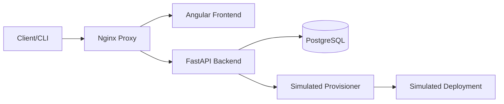

# Internal Developer Platform–Style API 🚀

[](https://sonarcloud.io/summary/new_code?id=null-pointer-sch_internal-platform-api)

A **full-stack platform demo** built with **FastAPI** (Backend) and **Angular** (Frontend) that explores patterns commonly used in **internal developer platforms** and platform engineering teams.

The API manages **projects**, **environments**, and **deployments**, inspired by tools such as Heroku, Render, Backstage, Humanitec, and custom internal PaaS solutions.



This project intentionally uses **simulated provisioning and deployment flows** to focus on **API design, data modelling, authentication, and platform concepts**, rather than real infrastructure execution.

---

## 🌍 Live Demo (Cloud Run – Europe)

- **Frontend UI**: https://internal-platform-api-frontend-3vr6excz6q-ew.a.run.app
- **Backend API**: https://internal-platform-api-backend-3vr6excz6q-ew.a.run.app (via Proxy)
- **API Docs**: [Swagger UI](https://internal-platform-api-frontend-3vr6excz6q-ew.a.run.app/api/v1/docs)
- **Health Check**: https://internal-platform-api-frontend-3vr6excz6q-ew.a.run.app/api/v1/health

---

## 🚀 Features

### 🔐 Authentication & Security
- **Full Auth Flow**: Register, Verify Email (Mock), Login, and Logout.
- **Dual Session Support**: Uses **Cookie-based sessions** with **CSRF protection** (XSRF-TOKEN) for the browser/UI, and supports **Bearer JWT** for API-first usage.
- **Reverse Proxy Architecture**: Nginx gracefully handles routing and path normalization (`/api/v1`).

### 📦 Projects
- Represent applications owned by authenticated users.
- Full CRUD under `/api/v1/projects`.

### 🌱 Environments
- Belong to a project with `ephemeral` or `persistent` types.
- Lifecycle simulation: `provisioning` → `running`.
- TTL support for ephemeral environments.
- Dynamic metadata (Base URL/ID) assignment during provisioning.

### 🚢 Deployments
- Version tracking (git SHA, tag) targeted at specific environments.
- Lifecycle simulation: `pending` → `running` → `succeeded`.
- Simulated async rollout and fake log streaming.

### 🧱 CI/CD & Infrastructure
- **Parallel Pipeline**: Faster cycle times via concurrent `test` and `dockerize` jobs.
- **Smart Caching**: GitHub Actions caching enabled for both `npm` and `poetry`.
- **Terraform IAC**: Fully automated deployment to Google Cloud Run and Artifact Registry.
- **E2E Smoke Testing**: Automated Python-based smoke tests (Backend, Frontend, and E2E) run on every push to ensure stability.

---

## 🛠 Installation & Running Locally

### 1. Backend (FastAPI)
```bash
cd backend
poetry install
poetry run uvicorn app.main:app --reload --port 8000
```
Docs: `http://localhost:8000/docs`

### 2. Frontend (Angular)
```bash
cd frontend
npm install
npm start
```
UI: `http://localhost:4200` (Note: requires running the backend or configuring a proxy).

---

## 🧪 Example Usage (with curl)

### 1. Register user
```bash
curl -s -X POST http://localhost:8000/api/v1/auth/register \
  -H "Content-Type: application/json" \
  -d '{"email":"test@example.com","password":"secret123"}'
```

### 2. Login
```bash
curl -s -X POST http://localhost:8000/api/v1/auth/login \
  -H "Content-Type: application/x-www-form-urlencoded" \
  -d "username=test@example.com&password=secret123"
```

### 3. Create a project (Bearer Auth)
```bash
curl -s -X POST http://localhost:8000/api/v1/projects/ \
  -H "Authorization: Bearer $TOKEN" \
  -H "Content-Type: application/json" \
  -d '{"name":"payments","description":"payment service"}'
```

---

## 📁 Folder Structure

```
.
├── backend/            # FastAPI Backend (Python 3.12, SQLAlchemy, Pydantic)
├── frontend/           # Angular Frontend (Standalone Components, Signals)
├── terraform/          # Infrastructure as Code (GCP Cloud Run)
├── scripts/            # E2E Smoke Testing Suite
└── scripts/            # CI/CD Python utilities
```

---

## 📜 License

MIT
